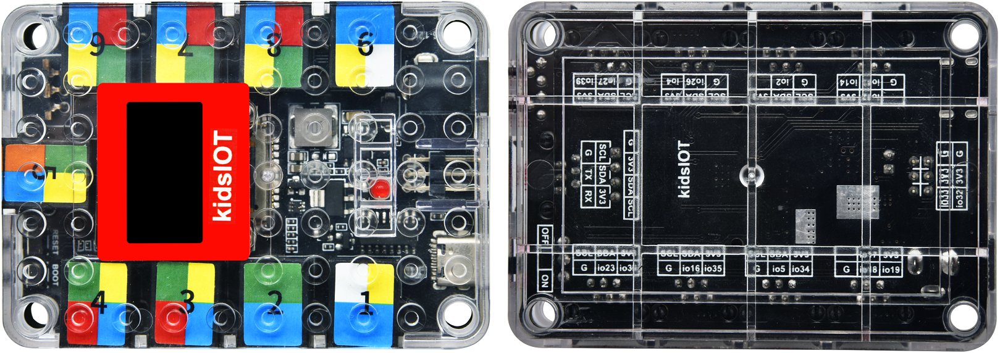
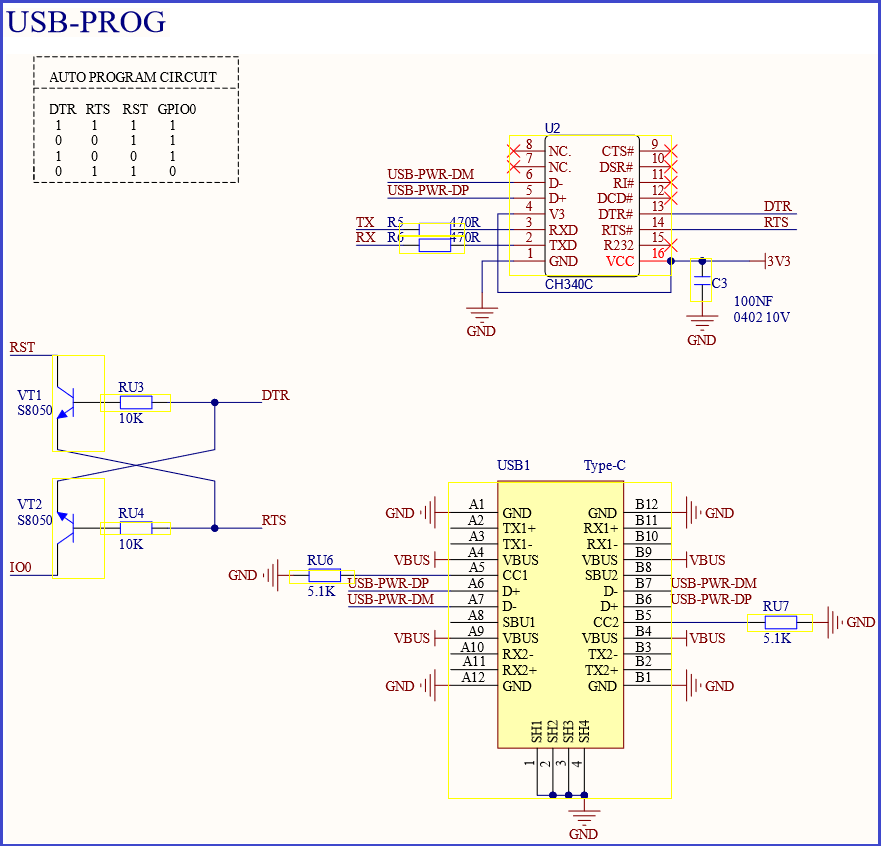
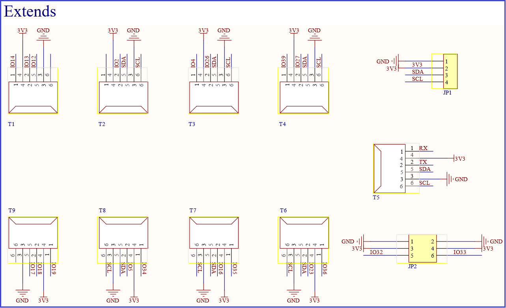
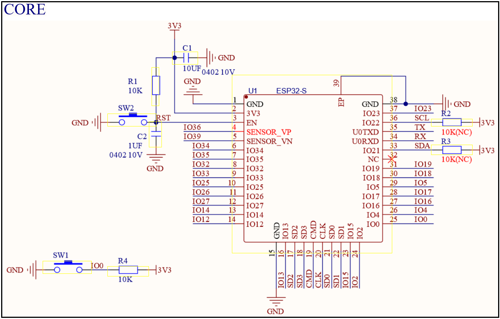
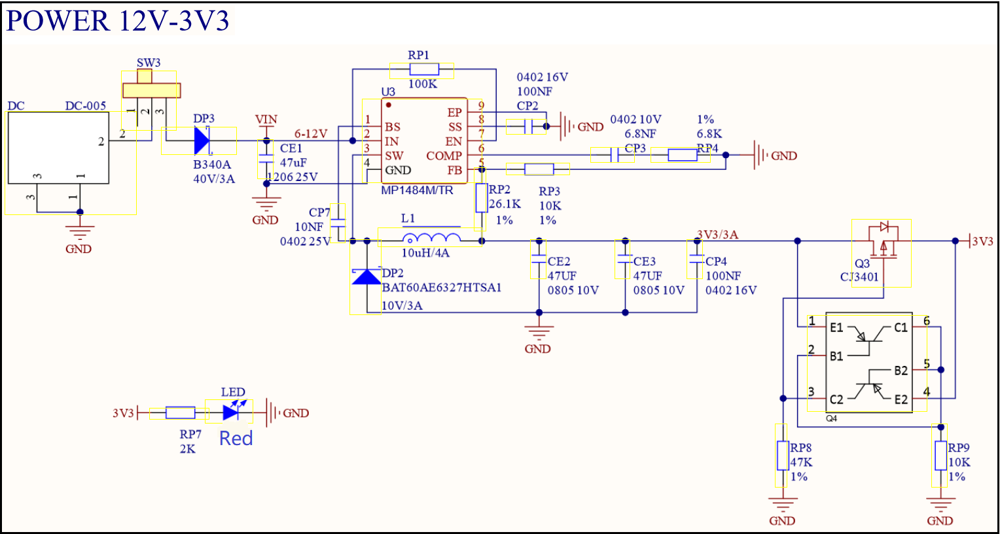
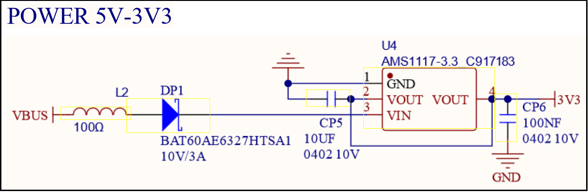
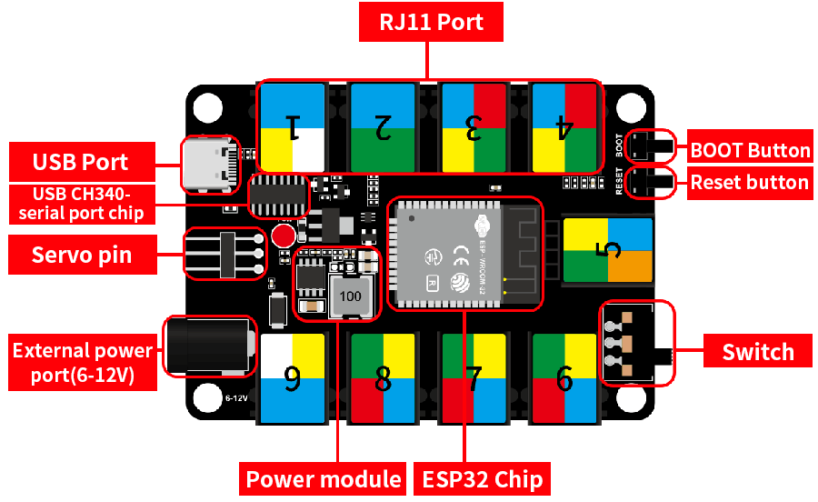
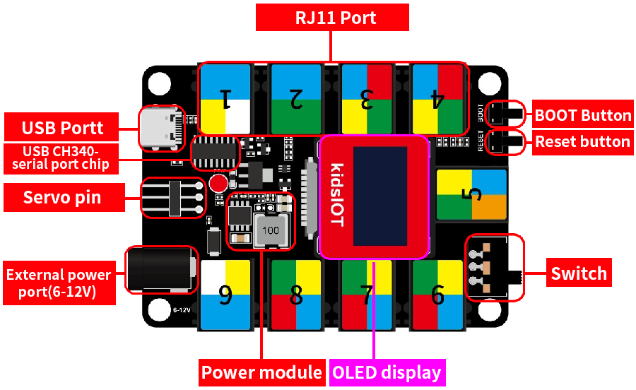
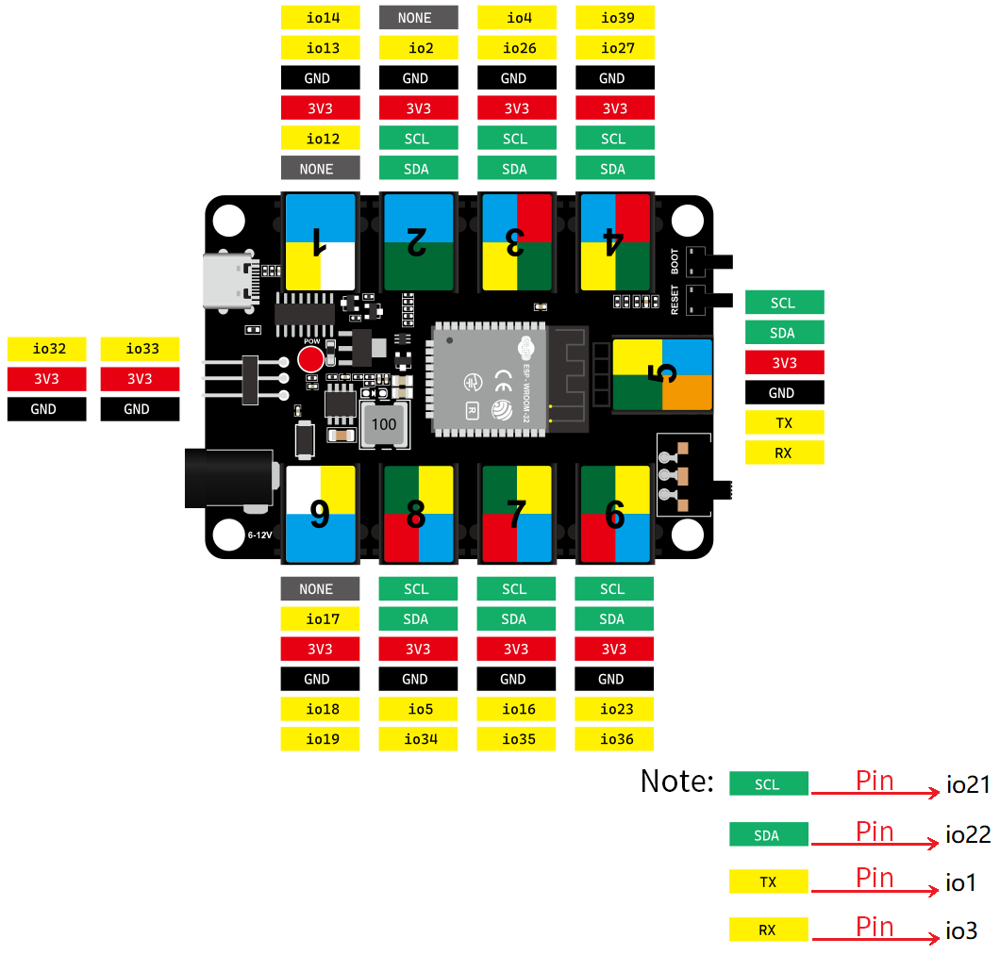
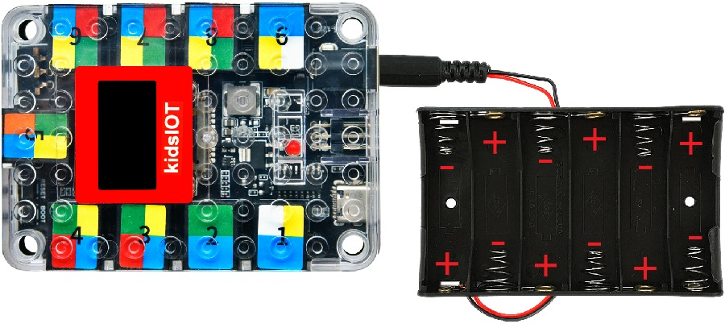

# KD2076 Kidsbits STEM Electronic Building Block Programming Development Controller for ESP32

## 1. Description

The kidsIOT STEM electronic building block programming development board is based on the ESP32-WROOM-32 module, which integrates traditional low-power Bluetooth and Wi-Fi. It has 19 digital I/O pins (can be used as PWM outputs), seven analog input pins,  seven I2C communication ports, two row pin ports (mainly used for connecting to servo), a USB port, a DC power port, a DC power switch, a BOOT button, a reset button, as well as a 128*64 OLED display (blue). 

What's more, it uses the telephone wire terminal as wiring port, expanding multiple peripherals such as SPI, I2C, UART and ADC. It is capable of driving a host of servos and sensors. Simply connect it to your computer via a USB-C cable, or power it with a DC adapter or batteries to get started. The housing boasts LEGO holes, which can be expanded to create multitudes of shapes when paired with LEGO blocks.

## 2. Parameters

- Microcontroller: ESP32-D0WDQ6

- Operating voltage: 3.3V

- Input voltage: USB power: 3.3V, DC power: 6-12V

- Digital I/O pins: 19 (TX (IO1), IO2, RX (IO3), IO4, IO5, IO12, IO13, IO14, IO16, IO17, IO18, IO19, SCL (IO21), SDA (IO22), IO23, IO26, IO27, IO32, IO33)

- PWM digital I/O pins: 19 (all digital I/O pins have PWM function)

- Analog input pins: 7 (IO4,IO32,IO33,IO34,IO35,IO36,IO39. Among them, pins used only for input: IO34,IO35,IO36,IO39)

- DC current per I/O pin: 20mA

- Flash memory: 4MB

- SRAM: 520KB

- Clock speed: Integrated crystal (40MHZ), default speed is 80MHZ, maximum is 240MHZ.

- WIFI Protocol: 802.11 b/g/n (802.11n, speed is up to 150 Mbps)

- WIFI Frequency: 2.4 GHz ~ 2.5 GHz

- Bluetooth Protocol: Compliant with Bluetooth V4.2 BR/EDR and BLE standard

- Bluetooth RF: NZIF receiver with -97dBm sensitivity, Class-1, Class-2 and Class-3 transmitters, AFH

- Total Current: 400mA （max output） for USB power, 1.6A （max output） for DC power.

- Maximum Power: 5.28W 

- Dimensions: 87.5mm x 60mm x 20mm

- Weight: 39g (without housing)

- Operating temperature range: -10℃ ~ 50 

- OLED display: the control chip is SSD1306, size is 0.96，use I2C communication, resolution is 128 * 64, display blue.

## 3. Schematic Diagram

## 4. Pin out

## 5. Battery Holder

The end of the battery holder with a spring is negative (-), and the other end is positive (+).  (6AA batteries are not provided. Please install them correctly. Younger students, please be accompanied by parents) 

 
