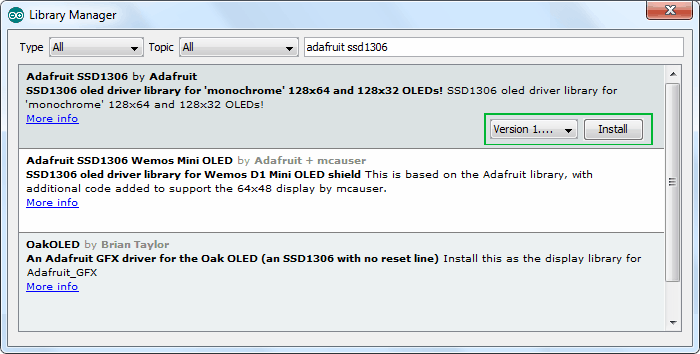

# KidsIOT STEM Education Development Board


## What is KidsIOT?

KidsIOT education development board is a teaching tool designed for students and beginners to develop interests and skills in science, technology, engineering and mathematics (STEM).

Its ESP32 chip provides complete solutions for various IoT applications. What’s more, its Wi-Fi and BT/BLE functions are fully compatible with the Arduino IDE development environment. By the way, it has 21 digital input/output pins (16 of which can be used as PWM output), 4 analog inputs, 7 sets of I2C interfaces, two servo pin interfaces as well as a 128*64 OLED display.

1. Suitable for beginners: The design is simple and easy to understand, which is suitable for beginners in the STEM field to get started quickly. It provides rich learning resources, tutorials and projects to help students gradually master programming and electronic principles.
2. Functional features: It boasts a 128*64 OLED screen, which is convenient for experiments and projects. It supports kidsblock graphical programming, making programming more intuitive and interesting. Furthermore, its extended interfaces can be used to connect additional modules and sensors, thus expanding students' creativity and project scope.
3. Teaching application: It can be used in STEM courses in schools to help students learn programming, electronic principles and engineering concepts. Students are encouraged to conduct practical projects and experiments to develop their problem-solving skills and innovative thinking.
4. Cross-platform support: It supports multiple programming languages and development environments such as Arduino IDE and Python.

## KidsIOT Specifications

|       Microcontroller       | ESP32-D0WDQ6                                                 |
| :-------------------------: | ------------------------------------------------------------ |
|      Operating voltage      | 3.3V                                                         |
|        Input voltage        | USB power:3.3V, DC power:6-12V                               |
|      Digital I/O pins       | 21（Among them, 3 pins are used only for input）             |
|       PWM digital I/O       | 18                                                           |
|      Analog input pins      | 13                                                           |
|   DC current per I/O pin    | 20MA                                                         |
|        Flash memory         | 4MB                                                          |
|            SRAM             | 520KB                                                        |
|         Clock speed         | Integrated crystal（40MHZ），default speed is 80MHZ, maximum is 240MHZ. |
|        WIFI Protocol        | 802.11 b/g/n（802.11n，speed is up to 150 Mbps）             |
|       WIFI Frequency        | 2.4 GHz ~ 2.5 GHz                                            |
|     Bluetooth Protocol      | Compliant with Bluetooth V4.2 BR/EDR and BLE standard        |
|        Bluetooth RF         | NZIF receiver with -97dBm sensitivity, Class-1, Class-2 and Class-3 transmitters, AFH |
|        Total Current        | 400mA （max output） for USB power, 1.6A （max output） for DC power. |
|        Maximum Power        | 5.28W                                                        |
| Operating temperature range | -10~50 degrees Celsius                                       |
|           Weight            | 50g                                                          |

## KidsIOT pinout


## What can KidsIOT do?

KidsIOT combines different types of sensors or modules to realize various applications such as STEM teaching, Internet of Things, intelligent control works, DIY creative works, etc.

1. Teaching application: It supports graphics and code programming, which can be used by students at different stages to learn programming.
2. Intelligent control application: It features ultra-high-performance main control and strong expansion ability, which is easy to realize various intelligent control works.
3. Application of DIY creative works: Combine input and output sensors and modules to quickly realize a variety of DIY creative works.


## How to use KidsIOT?

### getting started with Arduino IDE

#### Download Arduino IDE

When you get KidsIOT, you need to download Arduino IDE and driver firstly.

You could download Arduino IDE from the official website:

<https://www.arduino.cc/>, click the **SOFTWARE** on the browse bar to enter download page, as shown below:


There are various versions of IDE for Arduino. Just download a version compatible with your system. Here we will show you how to download and install the windows version of Arduino IDE.


You can choose between the Installer (.exe) and the Zip packages. We suggest you use the first one that installs directly everything you need to use the Arduino Software (IDE), including the drivers. With the Zip package you need to install the drivers manually. The Zip file is also useful if you want to create a portable installation.


You just need to click JUST DOWNLOAD.

#### Installing the driver for Windows system

##### Windows system


Download CH340 driver：

<https://sparks.gogo.co.nz/ch340.html>

Next, let’s install Arduino driver. 

For different operating system, there may be slight difference in installation method. Below is an example in WIN 7.

When you connect Arduino Uno to your computer the first time, right click “Computer” —> “Properties”—> “Device manager”, you can see “USB2.0-Serial”. 


Click “USB2.0-Serial”, select “Update Driver software”.


In this page, click “Browse my computer for driver software”.


Find the “usb_ch341_3.1.2009.06” file,Click “Next”.


Installation completed; click “Close”. 


After driver is installed, go to “Device manager” again. Right click “Computer” —>  “Properties”—> “Device manager”, you can see the CH340 device and COM port.


##### Installing the driver for Windows MAC system

Download CH340 driver：

<https://sparks.gogo.co.nz/ch340.html>

1) Click V1.5 CH340 MaxOS Driver package

   

   

   

2) After the download, you will see below:

   

3) click installation package and tap Continue.

   

4) Click Install.

   

5) Input your user password and click Install Software.

   

6) Tap Continue Installation.

   

7) Wait to install.

   

8) Click Restart after the installation is finished.


#### Arduino IDE Setting

To install ESP32 Board on Arduino IDE, do as following.

##### Step 1: Prepare the Arduino IDE

Open the Arduino IDE. Go to File → Preferences.


##### Step 2: Add the ESP32 Link

Add the link <https://dl.espressif.com/dl/package_esp32_index.json> to the “Additional Boards Manager URLs”. Click on OK.

**Attention**： If there is already a link in this section, separate the links using a comma.


##### Step 3: Open Boards Manager in Arduino IDE

In Arduino IDE, go to Tools → Board → Boards Manager…


##### Step 4: Install ESP32 Board

Type the word “ESP32” and wait for the results. Then install the “esp32 by Espressif Systems” by clicking on “Install”.


By clicking on “Install”, the Arduino IDE will start downloading and installing the ESP32 Boards. You will see something like this.


Wait for the installation to complete. Afterwards, you will see an image like this.


**Success**

You have successfully installed the ESP32 Boards on Arduino IDE.

#### onboard OLED display

kidsIOT is equipped with a 128x64 pixel OLED screen. Next, we will use the Arduino code to learn how to use this screen.

##### Installing an OLED Display Library

An OLED LCD display is integrated on the KisUno development board, the SSD1306 controller in the OLED display has a flexible but complex driver. To use the SSD1306 controller, extensive knowledge of memory addressing is required. Fortunately, the [SSD1306 library](https://github.com/adafruit/Adafruit_SSD1306) can be used to hide the complexities of the SSD1306 controller, allowing us to control the display with simple commands.

To install the library, navigate to Sketch > Include Library > Manage Libraries… Wait for the Library Manager to download the library index and update the list of installed libraries.


Filter your search by typing ‘adafruit ssd1306’. There should be a few entries. Look for SSD1306. Click on that entry and then choose Install.



This SSD1306 library is a hardware-specific library for low-level functions. To display graphics primitives such as points, lines, circles, and rectangles, it must be paired with the [Adafruit GFX Library](https://github.com/adafruit/Adafruit-GFX-Library). Install this library as well.


Internally, the SSD1306 library makes use of the [Adafruit Bus IO Library](https://github.com/adafruit/Adafruit_BusIO). So, look for Adafruit BusIO in the library manager and install it as well.


##### OLED Basic Drawings


Here’s a simple code that will do the following:

```c++
#include <Wire.h>
#include <Adafruit_GFX.h>
#include <Adafruit_SSD1306.h>

#define SCREEN_WIDTH 128 // OLED display width, in pixels
#define SCREEN_HEIGHT 64 // OLED display height, in pixels

// Declaration for SSD1306 display connected using I2C
#define OLED_RESET     -1 // Reset pin # (or -1 if sharing Arduino reset pin)
#define SCREEN_ADDRESS 0x3C
Adafruit_SSD1306 display(SCREEN_WIDTH, SCREEN_HEIGHT, &Wire, OLED_RESET);


void setup()
{
  Serial.begin(9600);
  
  // initialize the OLED object
  if(!display.begin(SSD1306_SWITCHCAPVCC, SCREEN_ADDRESS)) {
    Serial.println(F("SSD1306 allocation failed"));
    for(;;); // Don't proceed, loop forever
  }

  // Uncomment this if you are using SPI
  //if(!display.begin(SSD1306_SWITCHCAPVCC)) {
  //  Serial.println(F("SSD1306 allocation failed"));
  //  for(;;); // Don't proceed, loop forever
  //}

  // Clear the buffer.
  display.clearDisplay();

  // Draw Rectangle
  display.setTextSize(1);
  display.setTextColor(WHITE);
  display.setCursor(0,0);
  display.println("Rectangle");
  display.drawRect(0, 15, 60, 40, WHITE);
  display.display();
  delay(2000);
  display.clearDisplay();

  // Draw Filled Rectangle
  display.setTextSize(1);
  display.setTextColor(WHITE);
  display.setCursor(0,0);
  display.println("Filled Rectangle");
  display.fillRect(0, 15, 60, 40, WHITE);
  display.display();
  delay(2000);
  display.clearDisplay();

  // Draw Round Rectangle
  display.setTextSize(1);
  display.setTextColor(WHITE);
  display.setCursor(0,0);
  display.println("Round Rectangle");
  display.drawRoundRect(0, 15, 60, 40, 8, WHITE);
  display.display();
  delay(2000);
  display.clearDisplay();

  // Draw Filled Round Rectangle
  display.setTextSize(1);
  display.setTextColor(WHITE);
  display.setCursor(0,0);
  display.println("Filled Round Rectangl");
  display.fillRoundRect(0, 15, 60, 40, 8, WHITE);
  display.display();
  delay(2000);
  display.clearDisplay();

  // Draw Circle
  display.setTextSize(1);
  display.setTextColor(WHITE);
  display.setCursor(0,0);
  display.println("Circle");
  display.drawCircle(20, 35, 20, WHITE);
  display.display();
  delay(2000);
  display.clearDisplay();

  // Draw Filled Circle
  display.setTextSize(1);
  display.setTextColor(WHITE);
  display.setCursor(0,0);
  display.println("Filled Circle");
  display.fillCircle(20, 35, 20, WHITE);
  display.display();
  delay(2000);
  display.clearDisplay();

  // Draw Triangle
  display.setTextSize(1);
  display.setTextColor(WHITE);
  display.setCursor(0,0);
  display.println("Triangle");
  display.drawTriangle(30, 15, 0, 60, 60, 60, WHITE);
  display.display();
  delay(2000);
  display.clearDisplay();

  // Draw Filled Triangle
  display.setTextSize(1);
  display.setTextColor(WHITE);
  display.setCursor(0,0);
  display.println("Filled Triangle");
  display.fillTriangle(30, 15, 0, 60, 60, 60, WHITE);
  display.display();
  delay(2000);
  display.clearDisplay();
}

void loop() {
}
```


##### OLED Displays Text


```c++
#include <Wire.h>
#include <Adafruit_GFX.h>
#include <Adafruit_SSD1306.h>

#define SCREEN_WIDTH 128 // OLED display width, in pixels
#define SCREEN_HEIGHT 64 // OLED display height, in pixels
// Declaration for SSD1306 display connected using I2C
#define OLED_RESET     -1 // Reset pin # (or -1 if sharing Arduino reset pin)
#define SCREEN_ADDRESS 0x3C
Adafruit_SSD1306 display(SCREEN_WIDTH, SCREEN_HEIGHT, &Wire, OLED_RESET);
void setup()
{
  Serial.begin(9600);
  
  // initialize the OLED object
  if(!display.begin(SSD1306_SWITCHCAPVCC, SCREEN_ADDRESS)) {
    Serial.println(F("SSD1306 allocation failed"));
    for(;;); // Don't proceed, loop forever
  }
  // Clear the buffer.
  display.clearDisplay();

  // Display Text
  display.setTextSize(1);
  display.setTextColor(WHITE);
  display.setCursor(0,28);
  display.println("Hello world!");
  display.display();
  delay(2000);
  display.clearDisplay();

  // Display Inverted Text
  display.setTextColor(BLACK, WHITE); // 'inverted' text
  display.setCursor(0,28);
  display.println("Hello world!");
  display.display();
  delay(2000);
  display.clearDisplay();

  // Changing Font Size
  display.setTextColor(WHITE);
  display.setCursor(0,24);
  display.setTextSize(2);
  display.println("Hello!");
  display.display();
  delay(2000);
  display.clearDisplay();

  // Display Numbers
  display.setTextSize(1);
  display.setCursor(0,28);
  display.println(123456789);
  display.display();
  delay(2000);
  display.clearDisplay();

  // Specifying Base For Numbers
  display.setCursor(0,28);
  display.print("0x"); display.print(0xFF, HEX); 
  display.print("(HEX) = ");
  display.print(0xFF, DEC);
  display.println("(DEC)"); 
  display.display();
  delay(2000);
  display.clearDisplay();

  // Display ASCII Characters
  display.setCursor(0,24);
  display.setTextSize(2);
  display.write(3);
  display.display();
  delay(2000);
  display.clearDisplay();

  // Scroll full screen
  display.setCursor(0,0);
  display.setTextSize(1);
  display.println("Full");
  display.println("screen");
  display.println("scrolling!");
  display.display();
  display.startscrollright(0x00, 0x07);
  delay(2000);
  display.stopscroll();
  delay(1000);
  display.startscrollleft(0x00, 0x07);
  delay(2000);
  display.stopscroll();
  delay(1000);    
  display.startscrolldiagright(0x00, 0x07);
  delay(2000);
  display.startscrolldiagleft(0x00, 0x07);
  delay(2000);
  display.stopscroll();
  display.clearDisplay();

  // Scroll part of the screen
  display.setCursor(0,0);
  display.setTextSize(1);
  display.println("Scroll");
  display.println("some part");
  display.println("of the screen.");
  display.display();
  display.startscrollright(0x00, 0x00);
}
void loop() {
}
```


##### OLED Displays Bitmap


```c++
#include <SPI.h>
#include <Wire.h>
#include <Adafruit_GFX.h>
#include <Adafruit_SSD1306.h>

#define SCREEN_WIDTH 128 // OLED display width, in pixels
#define SCREEN_HEIGHT 64 // OLED display height, in pixels
// Declaration for SSD1306 display connected using I2C
#define OLED_RESET     -1 // Reset pin # (or -1 if sharing Arduino reset pin)
#define SCREEN_ADDRESS 0x3C
Adafruit_SSD1306 display(SCREEN_WIDTH, SCREEN_HEIGHT, &Wire, OLED_RESET);
// Declaration for SSD1306 display connected using software SPI:
//#define OLED_MOSI   9
//#define OLED_CLK   10
//#define OLED_DC    11
//#define OLED_CS    12
//#define OLED_RESET 13
//Adafruit_SSD1306 display(SCREEN_WIDTH, SCREEN_HEIGHT, OLED_MOSI, OLED_CLK, OLED_DC, OLED_RESET, OLED_CS);
// Bitmap of MarilynMonroe Imageconst 
const unsigned char MarilynMonroe [] PROGMEM = {
  0xff, 0xff, 0xff, 0xff, 0xff, 0xf8, 0x1f, 0xff, 0xff, 0xff, 0xff, 0xff, 0xff, 0xff, 0xff, 0xff, 
  0xff, 0xff, 0xff, 0xff, 0xff, 0xc0, 0x1f, 0xff, 0xff, 0xf0, 0x41, 0xff, 0xff, 0xff, 0xff, 0xff, 
  0xff, 0xff, 0xff, 0xff, 0xff, 0x80, 0x7f, 0xff, 0xff, 0xf8, 0x03, 0xff, 0xff, 0xff, 0xff, 0xff, 
  0xff, 0xff, 0xff, 0xff, 0xff, 0xf9, 0xff, 0xff, 0xff, 0xe0, 0x07, 0xff, 0xff, 0xff, 0xff, 0xff, 
  0xff, 0xff, 0xff, 0xff, 0xff, 0x87, 0xff, 0xff, 0xff, 0xf8, 0x03, 0xff, 0xff, 0xff, 0xff, 0xff, 
  0xff, 0xff, 0xff, 0xff, 0xff, 0x07, 0xff, 0xff, 0xff, 0xf8, 0x01, 0xf1, 0xff, 0xff, 0xff, 0xff, 
  0xff, 0xff, 0xff, 0xff, 0xff, 0x9f, 0xff, 0xff, 0xff, 0xf8, 0x00, 0xf8, 0xff, 0xff, 0xff, 0xff, 
  0xff, 0xff, 0xff, 0xff, 0xff, 0xbf, 0xff, 0xff, 0xff, 0xfc, 0x02, 0x78, 0x7f, 0xff, 0xff, 0xff, 
  0xff, 0xff, 0xff, 0xff, 0xff, 0xfc, 0x3f, 0xff, 0xff, 0xfe, 0x03, 0x7c, 0x1f, 0xff, 0xff, 0xff, 
  0xff, 0xff, 0xff, 0xff, 0xff, 0xf0, 0x07, 0xff, 0xff, 0xfe, 0x01, 0xfe, 0x1f, 0xff, 0xff, 0xff, 
  0xff, 0xff, 0xff, 0xff, 0xfd, 0xe0, 0x03, 0xff, 0xff, 0xfc, 0x00, 0xfe, 0x0f, 0xff, 0xff, 0xff, 
  0xff, 0xff, 0xff, 0xff, 0xfe, 0x87, 0xe0, 0xff, 0xff, 0xfc, 0x00, 0x06, 0x07, 0xff, 0xff, 0xff, 
  0xff, 0xff, 0xff, 0xff, 0xfc, 0x1f, 0xf9, 0xff, 0xff, 0xfc, 0x00, 0x02, 0x07, 0xff, 0xff, 0xff, 
  0xff, 0xff, 0xff, 0xff, 0xf8, 0x1f, 0xff, 0xff, 0xff, 0xfc, 0x00, 0xc3, 0xc3, 0xff, 0xff, 0xff, 
  0xff, 0xff, 0xff, 0xff, 0xf0, 0x3f, 0xff, 0xff, 0xe0, 0x0c, 0x00, 0xe7, 0x81, 0xff, 0xff, 0xff, 
  0xff, 0xff, 0xff, 0xff, 0xf0, 0x0f, 0xff, 0xff, 0xe0, 0x02, 0x00, 0x02, 0x00, 0xff, 0xff, 0xff, 
  0xff, 0xff, 0xff, 0xff, 0xf0, 0x0f, 0xff, 0xff, 0xe0, 0x01, 0x00, 0x00, 0x00, 0x3f, 0xff, 0xff, 
  0xff, 0xff, 0xff, 0xff, 0x80, 0x00, 0x3f, 0xff, 0xff, 0xe0, 0x00, 0x00, 0x1e, 0x3f, 0xff, 0xff, 
  0xff, 0xff, 0xff, 0xfc, 0x00, 0x00, 0x0f, 0xff, 0x3f, 0xf8, 0x00, 0x18, 0x7f, 0x1f, 0xff, 0xff, 
  0xff, 0xff, 0xff, 0xf8, 0x01, 0x80, 0x03, 0xfc, 0x3f, 0xfc, 0x00, 0x70, 0xfe, 0x1f, 0xff, 0xff, 
  0xff, 0xff, 0xff, 0xf0, 0x43, 0xff, 0xff, 0xf8, 0x7f, 0xf8, 0x00, 0x00, 0x7e, 0x1f, 0xff, 0xff, 
  0xff, 0xff, 0xff, 0xe0, 0x07, 0xff, 0xff, 0xf0, 0xff, 0xfc, 0x00, 0x00, 0x7c, 0x3f, 0xff, 0xff, 
  0xff, 0xff, 0xff, 0xe0, 0x0f, 0xff, 0xff, 0xf1, 0xef, 0xf8, 0x00, 0x01, 0xfc, 0x3f, 0xff, 0xff, 
  0xff, 0xff, 0xff, 0xe4, 0xff, 0xff, 0xff, 0xf3, 0x80, 0xa0, 0x00, 0x07, 0xfc, 0xaf, 0xff, 0xff, 
  0xff, 0xff, 0xff, 0xec, 0x5f, 0xff, 0xff, 0xe7, 0xf0, 0x00, 0x00, 0x03, 0xfe, 0xdf, 0xff, 0xff, 
  0xff, 0xff, 0xff, 0xee, 0x7f, 0xff, 0xff, 0xc7, 0xf8, 0x00, 0x00, 0x03, 0xff, 0xdf, 0xff, 0xff, 
  0xff, 0xff, 0xff, 0xfe, 0x7f, 0xff, 0xf7, 0xc7, 0xff, 0x06, 0x00, 0x03, 0xff, 0xbf, 0xff, 0xff, 
  0xff, 0xff, 0xff, 0xfe, 0x5f, 0xff, 0xc7, 0x07, 0xff, 0x80, 0x00, 0x07, 0xdb, 0xbf, 0xff, 0xff, 
  0xff, 0xff, 0xff, 0xee, 0xff, 0xff, 0x80, 0x03, 0xff, 0xc0, 0x00, 0x03, 0xc3, 0x0f, 0xff, 0xff, 
  0xff, 0xff, 0xff, 0xfe, 0xff, 0xff, 0x98, 0x03, 0xff, 0xf8, 0x00, 0x07, 0xe0, 0x0f, 0xff, 0xff, 
  0xff, 0xff, 0xff, 0xef, 0xff, 0xff, 0xf8, 0x01, 0xff, 0xfc, 0x01, 0x07, 0xfc, 0x1f, 0xff, 0xff, 
  0xff, 0xff, 0xff, 0xcf, 0xef, 0xff, 0xff, 0xe1, 0xff, 0xfc, 0x01, 0x07, 0xf8, 0x1f, 0xff, 0xff, 
  0xff, 0xff, 0xff, 0x9f, 0xff, 0xff, 0x7f, 0xf1, 0xff, 0xf8, 0x02, 0x07, 0x88, 0x3f, 0xff, 0xff, 
  0xff, 0xff, 0xff, 0xcf, 0xef, 0xf8, 0x0f, 0xff, 0xff, 0xe0, 0x00, 0x07, 0x84, 0x3f, 0xff, 0xff, 
  0xff, 0xff, 0xff, 0xe7, 0xef, 0xf0, 0x04, 0x7f, 0xff, 0xc0, 0x00, 0x07, 0x84, 0x7f, 0xff, 0xff, 
  0xff, 0xff, 0xff, 0x3f, 0xff, 0xe0, 0x00, 0x1f, 0xff, 0x80, 0x00, 0x06, 0x04, 0xff, 0xff, 0xff, 
  0xff, 0xff, 0xff, 0x3f, 0x7f, 0xe1, 0xf0, 0x07, 0xff, 0x80, 0x00, 0x07, 0x06, 0xff, 0xff, 0xff, 
  0xff, 0xff, 0xff, 0xff, 0xff, 0xc3, 0xfe, 0x03, 0xff, 0x00, 0x00, 0x03, 0x80, 0xff, 0xff, 0xff, 
  0xff, 0xff, 0xff, 0xf2, 0x3f, 0xc6, 0x7f, 0x81, 0xce, 0x00, 0x00, 0x01, 0xc1, 0xff, 0xff, 0xff, 
  0xff, 0xff, 0xff, 0xe0, 0x3f, 0xc0, 0x07, 0xc1, 0xfe, 0x00, 0x00, 0x0d, 0xc0, 0x7f, 0xff, 0xff, 
  0xff, 0xff, 0xff, 0xe0, 0x3f, 0xc0, 0x01, 0xe0, 0xfc, 0x00, 0x00, 0x0f, 0xc0, 0x7f, 0xff, 0xff, 
  0xff, 0xff, 0xff, 0xc0, 0x3f, 0xc0, 0x00, 0x50, 0xfc, 0x00, 0x00, 0x0e, 0xc0, 0xff, 0xff, 0xff, 
  0xff, 0xff, 0xff, 0xc0, 0x3f, 0xc0, 0x00, 0x18, 0xf8, 0x00, 0x00, 0x0e, 0xc1, 0xff, 0xff, 0xff, 
  0xff, 0xff, 0xff, 0xc0, 0x3f, 0xc0, 0x00, 0x00, 0xf8, 0x00, 0x00, 0x66, 0x81, 0xff, 0xff, 0xff, 
  0xff, 0xff, 0xff, 0xc0, 0x1f, 0xc7, 0x80, 0x00, 0xf8, 0x00, 0x01, 0xe0, 0x00, 0xff, 0xff, 0xff, 
  0xff, 0xff, 0xff, 0xc0, 0x1f, 0xc1, 0xe0, 0x01, 0xf8, 0x00, 0x03, 0xf0, 0x01, 0xff, 0xff, 0xff, 
  0xff, 0xff, 0xff, 0x80, 0x1f, 0xc0, 0x3e, 0x03, 0xf0, 0x00, 0x00, 0xe0, 0x03, 0xff, 0xff, 0xff, 
  0xff, 0xff, 0xff, 0x00, 0x1f, 0xe0, 0xe0, 0x03, 0xf2, 0x00, 0x00, 0xc0, 0x03, 0xff, 0xff, 0xff, 
  0xff, 0xff, 0xff, 0x80, 0x1f, 0xf0, 0x00, 0x07, 0xe6, 0x00, 0x00, 0xc0, 0x03, 0xff, 0xff, 0xff, 
  0xff, 0xff, 0xff, 0x80, 0x1f, 0xff, 0x00, 0x1f, 0xee, 0x00, 0x00, 0x80, 0x07, 0xff, 0xff, 0xff, 
  0xff, 0xff, 0xff, 0xb8, 0x0f, 0xff, 0xf0, 0x3f, 0xdc, 0x00, 0x00, 0x00, 0x0f, 0xff, 0xff, 0xff, 
  0xff, 0xff, 0xff, 0xbc, 0x0f, 0xff, 0xff, 0xff, 0xdc, 0x00, 0x00, 0x00, 0x0f, 0xff, 0xff, 0xff, 
  0xff, 0xff, 0xff, 0x9e, 0x0f, 0xff, 0xff, 0xff, 0xf8, 0x00, 0x00, 0x00, 0x1f, 0xff, 0xff, 0xff, 
  0xff, 0xff, 0xff, 0x08, 0x0f, 0xff, 0xff, 0xff, 0x70, 0x00, 0x00, 0x00, 0x1f, 0xff, 0xff, 0xff, 
  0xff, 0xff, 0xff, 0x00, 0x0b, 0xff, 0xff, 0xfe, 0xe0, 0x00, 0x00, 0x00, 0x1f, 0xff, 0xff, 0xff, 
  0xff, 0xff, 0xff, 0x00, 0x0b, 0xff, 0xff, 0xf9, 0xc0, 0x00, 0x00, 0x00, 0x3f, 0xff, 0xff, 0xff, 
  0xff, 0xff, 0xff, 0x3c, 0x09, 0xff, 0xff, 0xf1, 0x80, 0x00, 0x00, 0x00, 0x7f, 0xff, 0xff, 0xff, 
  0xff, 0xff, 0xff, 0x1e, 0x08, 0x3f, 0xff, 0xc0, 0x00, 0x00, 0x00, 0x00, 0x7f, 0xff, 0xff, 0xff, 
  0xff, 0xff, 0xff, 0x1f, 0x08, 0x03, 0xff, 0x00, 0x00, 0x00, 0x00, 0x00, 0x7f, 0xff, 0xff, 0xff, 
  0xff, 0xff, 0xff, 0x00, 0x08, 0x00, 0x00, 0x00, 0x00, 0x00, 0x00, 0x00, 0x1f, 0xff, 0xff, 0xff, 
  0xff, 0xff, 0xff, 0x80, 0x1c, 0x00, 0x00, 0x00, 0x00, 0x00, 0x00, 0x00, 0x1f, 0xff, 0xff, 0xff, 
  0xff, 0xff, 0xff, 0xce, 0x1c, 0x00, 0x00, 0x00, 0x00, 0x00, 0x00, 0x00, 0x1f, 0xff, 0xff, 0xff, 
  0xff, 0xff, 0xff, 0xfe, 0x1c, 0x00, 0x00, 0x00, 0x00, 0x00, 0x00, 0x00, 0x3f, 0xff, 0xff, 0xff, 
  0xff, 0xff, 0xff, 0xff, 0x7e, 0x00, 0x00, 0x00, 0x00, 0x00, 0x00, 0x00, 0x7f, 0xff, 0xff, 0xff
};
void setup()
{
  Serial.begin(9600);
  
  // initialize the OLED object
  if(!display.begin(SSD1306_SWITCHCAPVCC, SCREEN_ADDRESS)) {
    Serial.println(F("SSD1306 allocation failed"));
    for(;;); // Don't proceed, loop forever
  }

  // Uncomment this if you are using SPI
  //if(!display.begin(SSD1306_SWITCHCAPVCC)) {
  //  Serial.println(F("SSD1306 allocation failed"));
  //  for(;;); // Don't proceed, loop forever
  //}

  // Clear the buffer.
  display.clearDisplay();

  // Display bitmap
  display.drawBitmap(0, 0,  MarilynMonroe, 128, 64, WHITE);
  display.display();

  // Invert Display
  //display.invertDisplay(1);
}
void loop() {
}
```


### Getting started with kidsblock

#### Download kidsblock

Download the KidsBlock software

Download Link:

Windows: <https://www.kidsblock.cn/Down/KidsBlock.exe>

MacOS: <https://www.kidsblock.cn/Down/KidsBlock-MACOS.dmg>


Note: We take the Windows system as an example. 

#### kidsblock Setting

1. Double click “KidsBlock Setup.exe”.

   

2. Tap“Anyone who uses this computer(all users)”，then click“Next”

   

3. Click“**Browse...**”and choose the Disk where the software will be placed (here, we choose C Drive). Then click“**Install**”.

   

   

4. After a few seconds, the installation is complete.

   Click "Finish" to open the installed Kidsblock software.

   

5. If the computer security alert window appears, click “**Allow access”,** then we can open the Kidsblock. 

   

6. Click Check update underto update the software to the latest version.

   

#### Start First Program

After installing the Kidsblock software, let's start writing the first code. First, select the KidsIOT development board in the hardware selection.


Click Connect to connect the hardware, then return to the code editor,


We use a simple graphical program to let the serial port monitor print "hello, kidsblock".


After the code is ready, click Upload.


After the code is uploaded successfully, open the kidsblock software serial port monitor and adjust the baud rate to 9600, and then "hello, kidsblock" appears in the box on the right.


**Now, your first graphics code is successful.**

#### Onboard OLED display

kidsIOT is equipped with a 128x64 pixel OLED screen. Next, we will use the kidsblock graphical code to learn how to use this screen.

##### OLED Basic Drawings

OLED can be used to draw various basic geometric figures, such as lines, circles, rectangles, triangles and ellipses, etc. We can use Kidsblock graphical programming software to make OLED display different graphics.


##### OLED Displays Text

OLED uses thin-film materials and tiny electronic components to produce high-resolution displays and can also be used to display text. OLEDs are more energy efficient than LCD displays, with faster response times, they can transmit more information and are available over a wider field of view. We can use the Kidsblock to make OLED display different text.


##### OLED Displays Bitmap

OLED displays can display images, which are usually in white or black. To display an image, the color of the image must be determined first, then the pixel values in the image are converted to monochrome pixel values, and finally become a bitmap on the OLED monochrome display. In addition, the viewing angle of the OLED screen is also very large, the horizontal and vertical viewing angles both reach 180 degrees, and the screen content can be viewed from different angles. We can use the Kidsblock to make OLED display different images.


